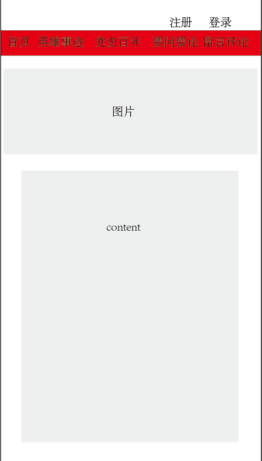
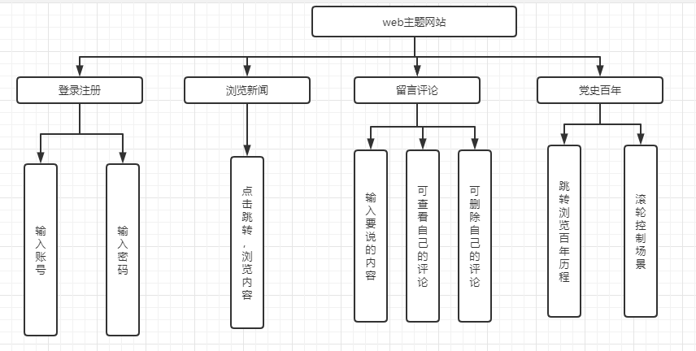

# XX-XX-2学期《Web程序设计》课程设计文档
班级：计算机193  学号：2019212212104  姓名: 张超
任课教师：张佳

## 1 选题及作品名称
>***献礼建党百年Web主题网站／作品名称***
>
>主题：献礼建党百年
>
>类型：web主题网站
>
>作品名称：建党百年

## 2 要实现的需求
>需求如下： 
>
>1） 结合设计主题进行设计实现，风格积极健康 
>
>2） 网站的内容需从数据库读取 
>
>3） 组队制作，需提供网站后台管理系统，即可以对数据库的页面内容进行 CRUD 操作 
>
>4） 单人制作，可只制作网站部分，内容直接从数据库中读取#

## 3 功能模块设计

### 3.1 流程设计


### 3.2 界面设计


首页


英雄事迹


留言评论


党史百年


要闻


内容展示



### 3.3 功能设计

>***本网站应用于展示党的历史和事迹，具体功能如下：***
>
>登录注册按钮：
>
>​		用于实现用户的登录和注册，需要用户输入账号和密码，用于给予用户评论的权限
>
>留言评论：
>
>​		用户让用户发表评论，用户需要输入自己要说的内容
>
>个人信息：
>
>​		可查看自己的评论，和可以删除自己的评论
>
>党史百年：
>
>​		跳转到展示党的百年历史上，利用滑轮实现类似与翻页的效果

>功能层次图



### 3.4 数据库设计

* 根据系统的功能设计，设计数据库表。
* 数据表较多时，前期设计需放上E-R图说明实体及其关系

>ER图


>表1  用户（users）

字段名称|数据类型|长度|字段含义|是否主键
--|:--:|:--:|:--:|--:
user_id|int|11|用户id|是
user_name|string|6|用户名|否
user_pwd|string|12|用户密码|否
> 表2 信息（messages）

| 字段名称        | 数据类型 | 长度 | 字段含义 | 是否主键 |
| --------------- | :------: | :--: | :------: | -------: |
| message_id      |   int    |  11  |  内容id  |       是 |
| message_content |  string  | 2000 |   内容   |       否 |

> 表3 评论（comments）

| 字段名称        | 数据类型 | 长度 |   字段含义   | 是否主键 |
| --------------- | :------: | :--: | :----------: | -------: |
| comment_id      |   int    |  11  |    评论id    |       是 |
| user_id         |   int    |  11  | 评论的用户id |       否 |
| comment_content |  string  | 100  |   评论内容   |       否 |

> 表4 人物信息（persons）

| 字段名称     | 数据类型 | 长度 | 字段含义 | 是否主键 |
| ------------ | :------: | :--: | :------: | -------: |
| person_id    |   int    |  11  |    id    |       是 |
| person_name  |   int    |  11  | 人物名称 |       否 |
| person_story |  string  | 200  | 人物故事 |       否 |

> 表4 要闻（news）
>

| 字段名称     | 数据类型 | 长度 | 字段含义 | 是否主键 |
| ------------ | :------: | :--: | :------: | -------: |
| news_id      |   int    |  11  |    id    |       是 |
| news_message |  string  | 2000 | 要闻内容 |       否 |


### 3.5 接口设计


> 1.用户登陆判断接口
* 接口描述：用于检查用户是否存在于数据库中
* 请求方式：get
* 请求地址：http://localhost/design/src/server/isLogin.php
* 参数设置：如下所示
---
参数名称|数据类型|含义|是否必需
--|:--:|:--:|--:
user_name|String|用户名|是
user_pwd|string|用户密码|是
* 数据返回成功结果：如下所示

```
[
    {
        code:"1",
        data:['text'],
        msg:"success"
    }
]

```

* 数据返回失败结果：如下所示

```
[
    {
        code:"0",
        data:[],
        msg:"fail"
    }
]
```


---
> 2:获得评论的信息

- 接口描述：获得所有的评论信息
- 请求方式：get
- 请求地址：http://localhost/exam/src/server/getComments.php
- 参数设置：无
- 数据返回成功结果：如下所示

```
[
    {
        code:"1",
        data:[获得的内容],
        msg:"success"
    }
]

```

* 数据返回失败结果：如下所示

```
[
    {
        code:"0",
        data:[],
        msg:"fail"
    }
]
```

****

> 3:添加评论

- 接口描述：用户可以添加评论
- 请求方式：post
- 请求地址：http://localhost/exam/src/server/addComment.php
- 参数设置：如下所示

---

| 参数名称     | 数据类型 |    含义    | 是否必需 |
| ------------ | :------: | :--------: | -------: |
| user_name    |  String  |   用户名   |       是 |
| user_comment |  string  | 用户的评论 |       是 |

* 数据返回成功结果：如下所示

```
[
    {
        code:"1",
        data:[],
        msg:"success"
    }
]

```

* 数据返回失败结果：如下所示

```
[
    {
        code:"0",
        data:[],
        msg:"fail"
    }
]
```


> 4.删除评论

- 接口描述：用户可以删除自己的评论
- 请求方式：post
- 请求地址：http://localhost/exam/src/server/deleteComment.php
- 参数设置：**如下所示**

| 参数名称   | 数据类型 |  含义  | 是否必需 |
| ---------- | :------: | :----: | -------: |
| user_name  |  String  | 用户名 |       是 |
| comment_id |   int    | 评论id |       是 |

* 数据返回成功结果：如下所示

```
[
    {
        code:"1",
        data:[],
        msg:"success"
    }
]

```

* 数据返回失败结果：如下所示

```
[
    {
        code:"0",
        data:[],
        msg:"fail"
    }
]
```


> 5.获得自己的评论

- 接口描述：用户可以获得自己的评论
- 请求方式：get
- 请求地址：http://localhost/exam/src/server/getOneselfComment.php
- 参数设置：**如下所示**

| 参数名称  | 数据类型 |  含义  | 是否必需 |
| --------- | :------: | :----: | -------: |
| user_name |  String  | 用户名 |       是 |

* 数据返回成功结果：如下所示

```
[
    {
        code:"1",
        data:[获得的内容],
        msg:"success"
    }
]

```

* 数据返回失败结果：如下所示

```
[
    {
        code:"0",
        data:[],
        msg:"fail"
    }
]
```


> 6:用户注册

- 接口描述：用户可以添加评论
- 请求方式：post
- 请求地址：http://localhost/exam/src/server/register.php
- 参数设置：如下所示

| 参数名称  | 数据类型 |   含义   | 是否必需 |
| --------- | :------: | :------: | -------: |
| user_name |  String  |  用户名  |       是 |
| user_pwd  |  string  | 用户密码 |       是 |

* 数据返回成功结果：如下所示

```
[
    {
        code:"1",
        data:[],
        msg:"success"
    }
]

```

* 数据返回失败结果：如下所示

```
[
    {
        code:"0",
        data:[],
        msg:"fail"
    }
]
```


> 7：获得公告信息

- 接口描述：获得公告信息
- 请求方式：get
- 请求地址：http://localhost/exam/src/server/getMessages.php
- 参数设置：无
- 数据返回成功结果：如下所示

```
[
    {
        code:"1",
        data:[获得的内容],
        msg:"success"
    }
]

```

* 数据返回失败结果：如下所示

```
[
    {
        code:"0",
        data:[],
        msg:"fail"
    }
]
```


> 8:获得人物信息

- 接口描述：获得公告信息
- 请求方式：get
- 请求地址：http://localhost/exam/src/server/getPersonsStory.php
- 参数设置：无
- 数据返回成功结果：如下所示

```
[
    {
        code:"1",
        data:[获得的内容],
        msg:"success"
    }
]

```

* 数据返回失败结果：如下所示

```
[
    {
        code:"0",
        data:[],
        msg:"fail"
    }
]
```


> 9.获得要闻信息

- 接口描述：获得要闻信息
- 请求方式：get
- 请求地址：http://localhost/exam/src/server/getNewContents.php
- 参数设置：无
- 数据返回成功结果：如下所示

```
[
    {
        code:"1",
        data:[获得的内容],
        msg:"success"
    }
]

```

* 数据返回失败结果：如下所示

```
[
    {
        code:"0",
        data:[],
        msg:"fail"
    }
]
```


## 4 软件说明

### 4.1 开发环境说明
>***说明：服务端或者客户端的开发工具、调试环境等***
>
>开发工具：vscode
>
>服务端：php  5.5.12
>
>数据库：MySQL  5.6.17


### 4.2 运行环境说明
>***说明：服务端运行环境，客户端运行环境/所用浏览器以及其版本***
>
>服务器运行环境：wamp 2.5
>
>浏览器：谷歌浏览器

#

## 5 开发计划
### 5.1 时间安排

时间|计划内容|分工情况|备注
--|:--:|:--:|--:
5月7日|选题截止|个人|无
5月14日|课程设计截止|个人|无
5月15日|首页+新闻展示|个人|无
5月16日|留言评论|个人|无
5月17日|英雄事迹|个人|无
5月19日|要闻要论|个人|无
21日-23日|党史百年|个人|视情况增加时间
24日-27日|微调修改|个人|无


### 5.2 项目分工
>个人完成：无分组情况
## 6 非原创部分说明
1. Bootstrap，http://bootcss.com，用于前端界面搭建和交互组件调用
2. jQuery,https://jquery.com/，用于前端交互开发的JS框架
3. fullpage, jquery插件，用于制作全屏网站

****
